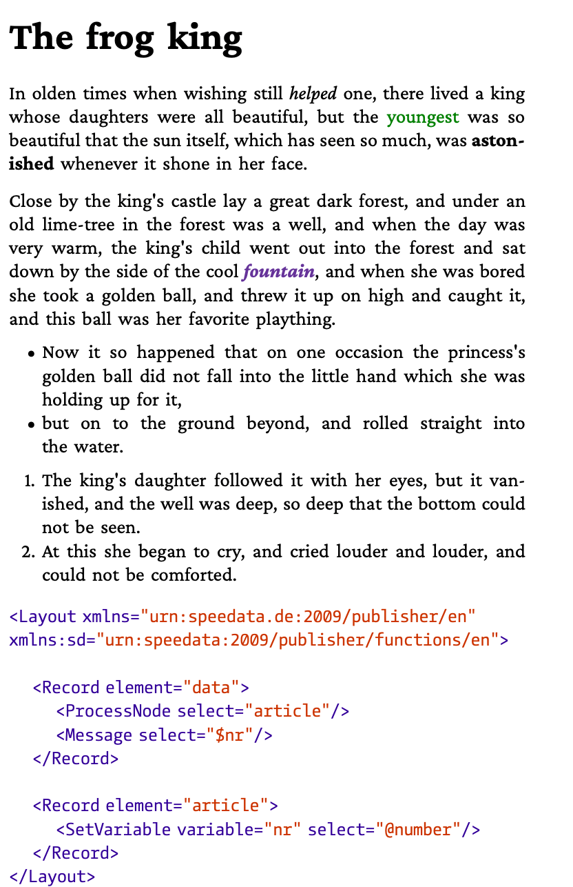
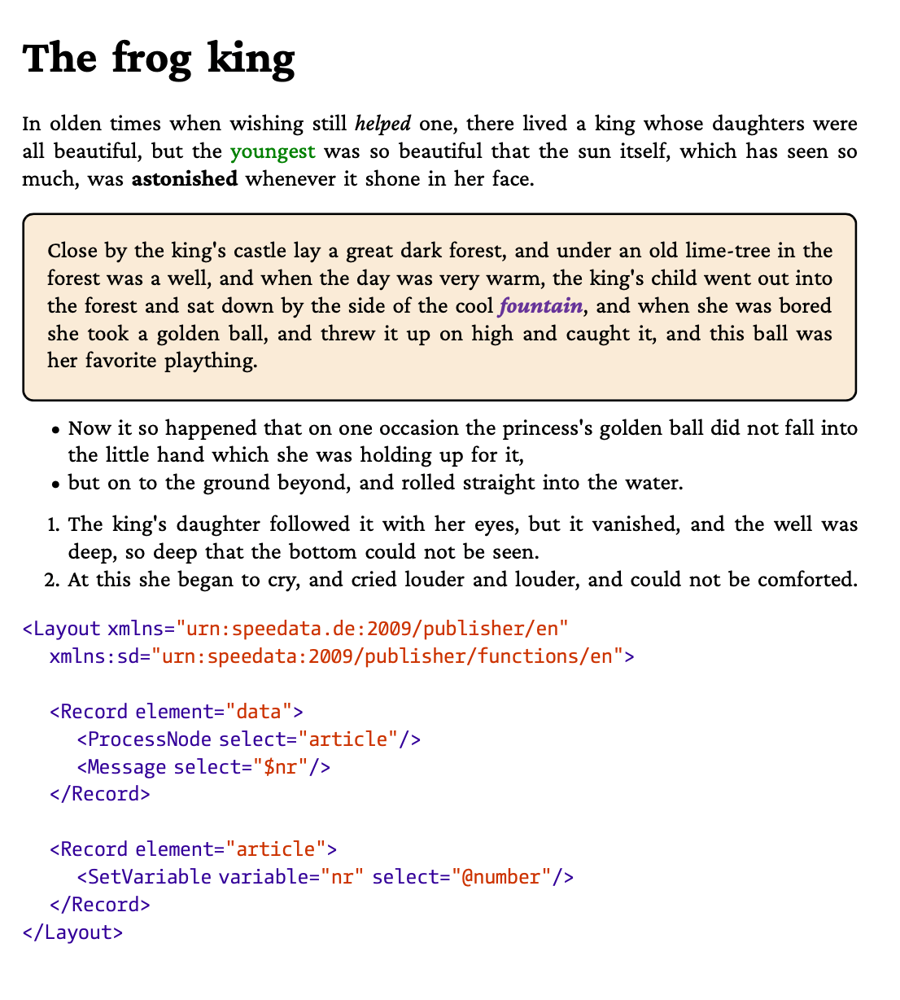

This repository contains ready-to-run examples for the [bagme](https://github.com/speedata/bagme) library.

Description  | Preview
------------ | -------------
[Simple example](basic/simple) | 
[Border example](basic/border) | 
